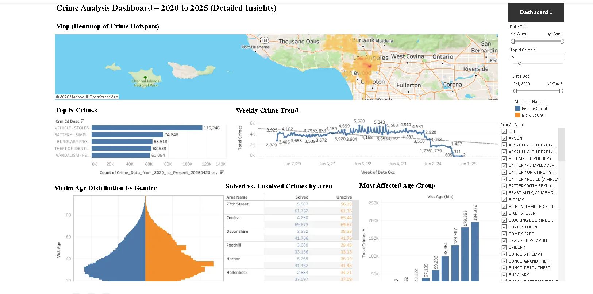
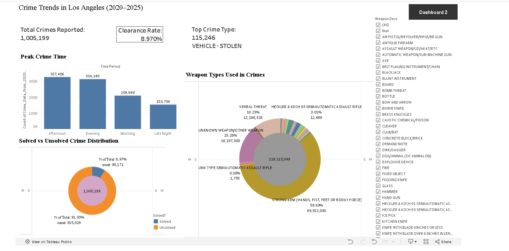

# 🚔 Crime Trends in Los Angeles — Tableau BI Dashboard

**🔗 Live Tableau Dashboard:** [https://public.tableau.com/app/profile/ronil.ghoghari3778/viz/Final_Project_Code_Blooded/Dashboard1?publish=yes](https://public.tableau.com/app/profile/ronil.ghoghari3778/viz/Final_Project_Code_Blooded/Dashboard1?publish=yes)

## 📊 Dashboard Preview

### Detailed Crime Analysis



### KPI & Crime Profile Overview



The live Tableau dashboard includes interactive date, crime-type and Top-N controls for exploring the data dynamically.

A **Business Intelligence and data-visualization project** exploring Los Angeles crime patterns from 2020 onward using more than one million LAPD incident records. The project uses **Tableau** to analyze crime categories, geographic hotspots, time trends, victim demographics and case-status patterns through an interactive dashboard.

> I independently developed this project as coursework for a Business Intelligence course. The original `.twbx` workbook is no longer available, so this repository preserves the project as a documented case study and links directly to the original working Tableau Public dashboard.

## 🎯 Project motivation

Los Angeles experienced major social and economic changes after 2020, including the COVID-19 pandemic, lockdowns, protests and recovery periods. The project was designed to investigate how reported crime patterns changed across that period and to communicate the results through an accessible BI dashboard.

## ❓ Questions explored

- Which crime types are most common?
- Which LAPD areas report the most incidents?
- Are there monthly or seasonal patterns?
- What does the victim age/sex distribution look like?
- How have recorded crime patterns shifted since 2020?
- How are incidents distributed across case-status categories?

## 📊 Dashboard components

The original Tableau project contains six major analytical views:

| Visualization | Purpose |
|---|---|
| **Crime heatmap** | Identify geographic concentrations using latitude/longitude |
| **Top crimes bar chart** | Rank the most frequent crime categories |
| **Monthly line chart** | Explore temporal patterns and post-2020 changes |
| **Butterfly chart** | Compare male vs. female victims across age groups |
| **Conditional-format table** | Compare incident volume/status across LAPD areas |
| **KPI cards** | Summarize incidents, status/clearance and peak crime time |

Interactive features include **Year, Area and Crime Type filters**, a **Top N parameter**, and dynamic KPIs.

See [`docs/dashboard-design.md`](docs/dashboard-design.md) for the documented dashboard design.

## 🗃️ Dataset

The project uses the LAPD / City of Los Angeles **Crime Data from 2020 to Present** dataset.

**Official data source:** https://data.lacity.org/Public-Safety/Crime-Data-from-2020-to-Present/2nrs-mtv8/about_data

The archived snapshot used for this portfolio review contains:

- **1,005,199 records**
- **28 columns**
- incident dates from **2020-01-01 through 2025-04-01**
- crime type, LAPD area, date/time, victim demographics, status and geospatial coordinates

The raw CSV is approximately **255 MB** and is intentionally excluded from GitHub. See [`data/README.md`](data/README.md).

## 🔍 Selected findings

The original project narrative highlighted:

- **Vehicle - Stolen** was the most frequent crime category with **115,246 incidents**.
- **Afternoon** was the highest-volume time period with **327,406 incidents**, followed by Evening with **314,140**.
- persistent high-volume LAPD divisions including 77th Street and Southeast.
- young adults (especially ages 20–34) as a major victim group.
- a post-lockdown rise in recorded incidents.
- a dashboard clearance rate of **8.97%**, with **90,171 solved** and **915,028 solved** incidents in the archived snapshot.

Because the `.twbx` calculated fields are no longer available, the repository clearly separates **original Tableau findings** from figures that can be recomputed directly from the archived CSV.

### Archived-data validation

Direct checks against the supplied CSV show:

- **Vehicle - Stolen:** 115,246 records
- **Battery - Simple Assault:** 74,848 records
- **Central:** 69,673 records
- **77th Street:** 61,762 records
- **20–34:** 284,192 records among valid victim ages

See [`docs/archived-data-snapshot.md`](docs/archived-data-snapshot.md).

## 🧹 Data-quality considerations

The archived dataset contains several issues that matter for BI interpretation:

- many records use `Vict Age = 0`;
- victim sex/descent can be missing;
- some map coordinates are zero values;
- weapon descriptions are frequently absent;
- the supplied 2024/2025 snapshot is not directly comparable to complete earlier years;
- case status is categorical and the original “solved” calculated-field definition is unavailable without the Tableau workbook.

See [`docs/data-quality-notes.md`](docs/data-quality-notes.md).

## 🧠 BI skills demonstrated

- Tableau dashboard design
- large-dataset exploration (1M+ rows)
- geographic visualization
- KPI design
- parameters and Top-N analysis
- interactive filters
- time-series visualization
- demographic comparison
- conditional formatting
- data cleaning / interpretation
- visual storytelling

## 📁 Repository structure

```text
.
├── data/
│   └── README.md
├── docs/
│   ├── archived-data-snapshot.md
│   ├── dashboard-design.md
│   ├── data-dictionary.md
│   └── data-quality-notes.md
├── assets/
├── .gitignore
└── README.md
```

## ⚠️ Archival note

The original Tableau packaged workbook (`.twbx`) was not preserved. The **Tableau Public deployment is still live**, so it serves as the primary interactive artifact for this project. This GitHub repository provides the supporting project narrative, source-data documentation and reproducibility notes.

## 👤 Project context

This is an archived educational Business Intelligence project presented to demonstrate my work with Tableau, large public datasets, interactive dashboards, KPI design and visual data storytelling.
